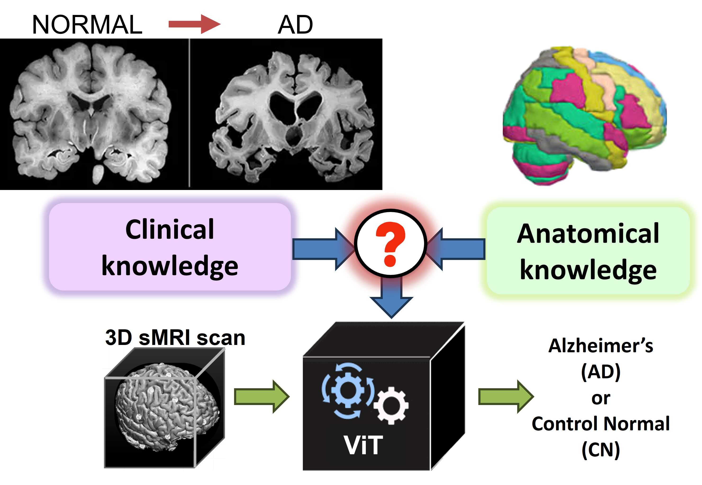
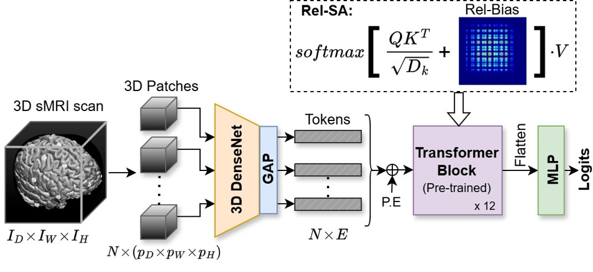
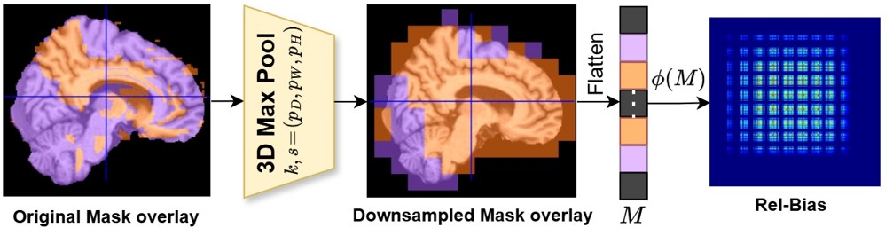
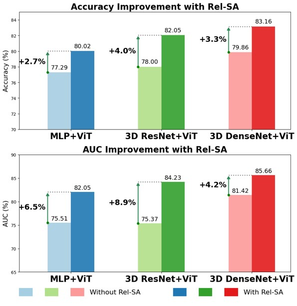
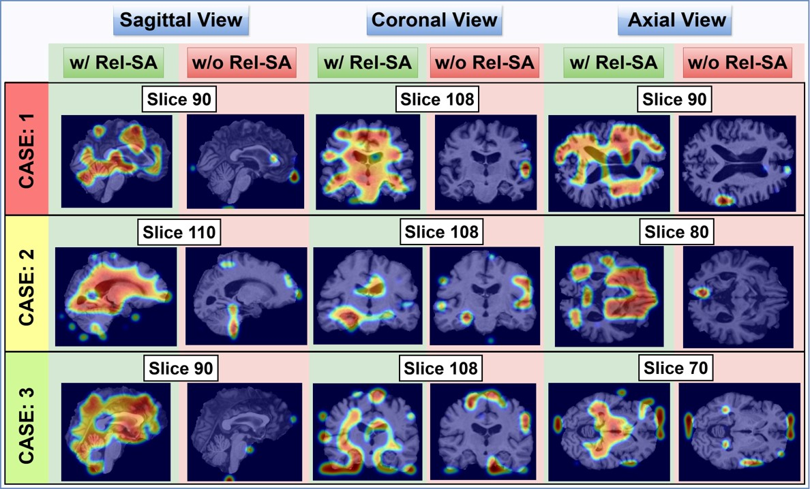

# Rel-SA
Alzheimer’s Disease Detection using Relevance-augmented Self Attention by Inducing Domain Priors in Vision Transformers

### Problem Statement
Can we incorporate crucial domain-specific knowledge, both clinical and anatomical, as an inductive bias for ViT-based models to learn effectively?

  

### Contributions
Our contributions include:
- Relevance Augmented Self Attention (Rel-SA) module, encoding clinical priors using Relevance Bias
- Unifying two clinically validated brain atlases: 1) AAL3v1 and 2) JHU White Matter atlas
- Qualitative Evaluation through Leave-One-Out Analysis and Reverse Analysis

### Model Architecture

  

  

### Experiments and Performance Analysis
Rel-SA is tested with ADNI and AIBL datasets
- Rel-SA’s max boost to ViT-base: Accuracy: ∼4% & AUC: ∼9% 
- Parametric overhead: just 24 additional parameters!
      

  

Attention Rollout is performed to understand the importance of Rel-SA's introduction into ViTs:

  

### Post-hoc Analysis
Qualitative analysis is performed by two techniques:
- Leave-One-Out Analysis
- Reverse Analysis

### Conclusion
- Our results depict that integrating clinical knowledge through Rel-SA can have a considerable impact both in terms of performance and faithful interpretations of the sMRI data consistent with Neuroscience literature.
- The key lies in leveraging domain knowledge as the right inductive bias.

